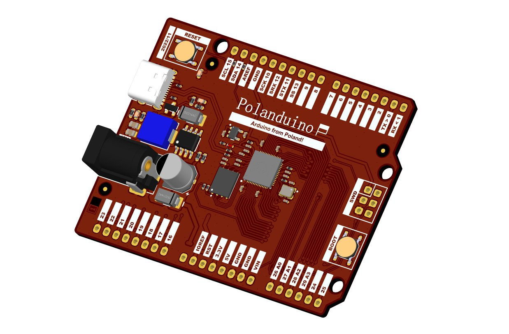
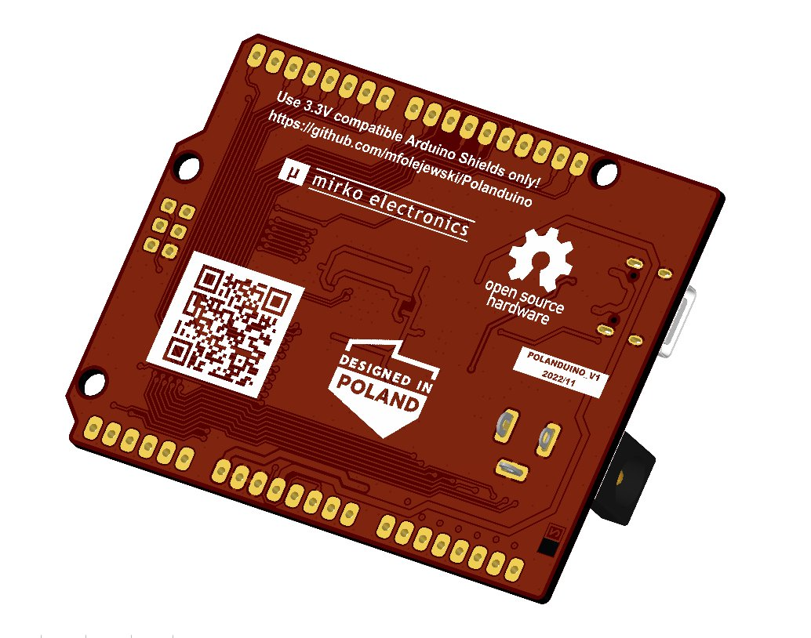

# Polanduino - Arduino from Poland (RP2040 board)

## Description
TBD

## License
Project published as Open Source Hardware (OSHW) under CERN OHL v1.2 (Open Hardware Licence).

## Press release
TBD

## Photos
TBD

