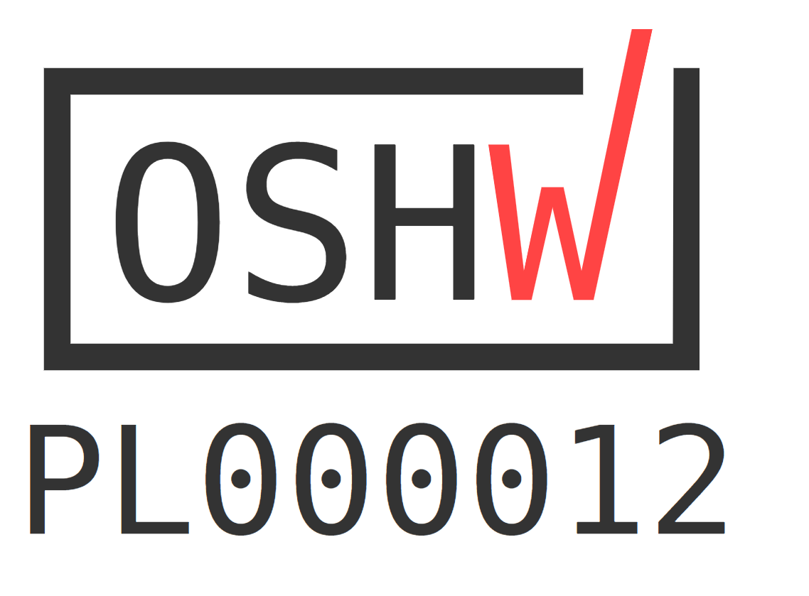
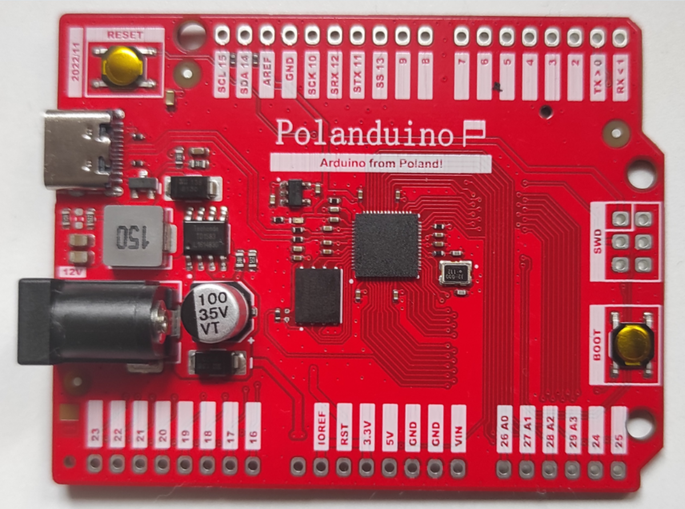
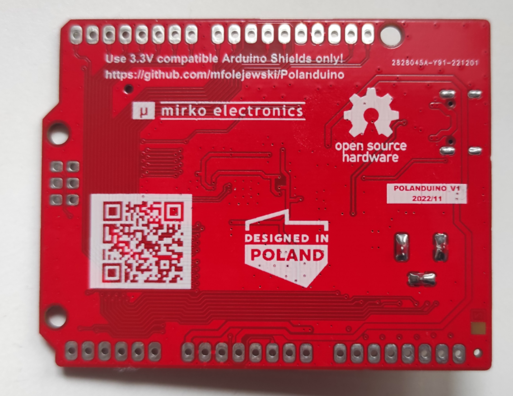

# Polanduino - Arduino from Poland (RP2040 board)

## Description
Polanduino is a Raspberry Pi RP2040 evaluation board with classic Arduino Uno form factor, which has features, as following:
- PCB dimensions: 68,58 x 53,34 mm,
- all 30 GPIO pins connected to the pin header (Arduino Uno standard with extra 8 GPIO pins),
- 2-layer PCB board,
- onboard: 8MB QSPI Flash (WSON8 package), 12MHz oscillator, PWR LED,
- RESET/BOOT switches,
- USB-C interface for power supply, debugging MCU and for flashing SPI memory,
- DC barrel jack for power supply (12VDC default) 
- fully open source project (OSHW).

Here you can find:
- \Manufacturing files: all the production files for PCB ordering and assembly at JLCPCB (Gerber files, Pick & Place, BOM, etc.)
- \source files: source files in Altium Designer format (KiCad: TBD)

## License
Project published as Open Source Hardware (OSHW) under CERN OHL v1.2 (Open Hardware Licence).

Project has been certified as Open Source Hardware by the Open Source Hardware Association (OSHWA).

UID is: PL000012

https://certification.oshwa.org/pl000012.html

## Press release
TBD

## Photos

